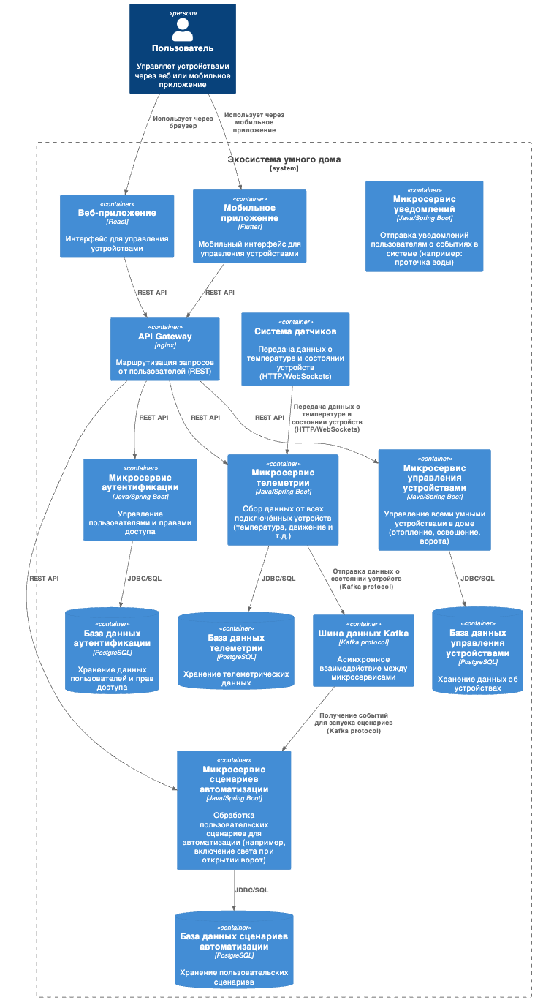
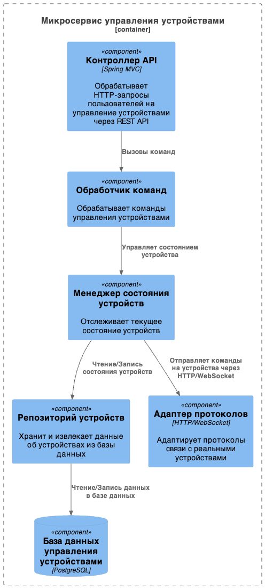
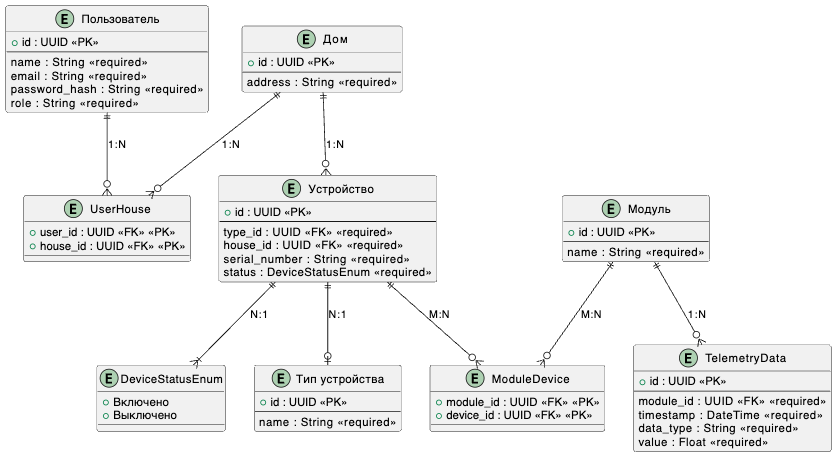

# Sprint 3

## Анализ текущей архитектуры

### 1. Изучение функциональности монолитного приложения

Приложение *Smart Home Monolith* предоставляет следующие ключевые функции:

- **Управление отоплением**: Пользователи могут удалённо включать и выключать отопление в своих домах через веб-интерфейс.
- **Мониторинг температуры**: Система получает данные о температуре с датчиков, установленных в домах, и отображает их пользователям через веб-интерфейс. Это позволяет пользователям отслеживать текущую температуру в реальном времени.

### 2. Анализ архитектуры монолитного приложения

Приложение построено на основе следующих технологий и архитектурных решений:

- **Язык программирования**: Java.
- **База данных**: PostgreSQL.
- **Архитектура**: Монолитная архитектура, где все компоненты (контроллеры, сервисы, репозитории) находятся в одном приложении. Это означает, что весь код приложения тесно связан и развёртывается как единое целое.
- **Взаимодействие**: Синхронная обработка запросов. Это может приводить к задержкам при высоких нагрузках, так как все запросы обрабатываются последовательно.
- **Масштабируемость**: Ограничена, так как монолитное приложение сложно масштабировать частично. Для увеличения производительности необходимо масштабировать всё приложение целиком.
- **Развёртывание**: Любое изменение требует перезапуска всего приложения, что может привести к простою системы.

### 3. Определение доменов и границ контекстов

Для данного приложения можно выделить несколько доменов:

- **Управление устройствами**: Этот домен включает управление отоплением (включение/выключение системы отопления).
- **Мониторинг данных с датчиков**: Этот домен отвечает за сбор и отображение данных о температуре с датчиков.
- **Пользовательский интерфейс (UI)**: Веб-интерфейс для взаимодействия пользователей с системой (отображение температуры, управление отоплением).
- **Аутентификация и авторизация**: Обеспечивает безопасность доступа к системе.

Эти домены можно разделить на отдельные контексты, которые в будущем могут быть вынесены в микросервисы для улучшения масштабируемости и управляемости системы.

### 4. Проблемы монолитной архитектуры

Монолитная архитектура имеет несколько недостатков в контексте бизнес-задач компании:

- **Масштабируемость**: Как уже отмечалось, монолитное приложение сложно масштабировать по частям. Например, если нагрузка возрастает только на модуль мониторинга температуры, придётся масштабировать всё приложение целиком.
  
- **Гибкость разработки**: Внесение изменений в один компонент требует пересборки и перезапуска всего приложения. Это замедляет процесс разработки и развёртывания новых функций.

- **Низкая отказоустойчивость**: Падение одного компонента может привести к остановке всего приложения. Например, если возникнет проблема с модулем управления отоплением, это может повлиять на всю систему.

- **Зависимость компонентов**: Все компоненты тесно связаны между собой, что усложняет тестирование и внесение изменений без риска повредить другие части системы.

### 5. Диаграмма контекста (Context Diagram)


файл: [SH-monolith-components.puml](./diagrams/SH-monolith-components.puml)


## Проектирование новой микросервисоной архитектуры


### 1. Декомпозиция приложения на микросервисы

Для декомпозиции монолитного приложения на микросервисы, основываясь на ранее выделенных доменах и бизнес-целях компании «Тёплый дом», можно предложить следующую структуру микросервисов.

#### **As-Is решение (текущее состояние)**:

- **Микросервис управления отоплением**:
  - Отвечает за включение/выключение отопления.
  - Обрабатывает команды от пользователя через веб-интерфейс.
  - Взаимодействует с устройствами отопления через API.

- **Микросервис мониторинга температуры**:
  - Получает данные с датчиков температуры.
  - Хранит и отображает данные пользователю в реальном времени.

#### **To-Be решение (целевая архитектура)**:

Для достижения целей компании и расширения функциональности системы, потребуется добавить новые микросервисы и переработать существующие:

- **Микросервис управления устройствами**:
  - Управление всеми умными устройствами в доме (отопление, освещение, ворота и т.д.).
  - Поддержка стандартных протоколов для взаимодействия с устройствами от разных производителей.
  - Подключение новых устройств пользователем через самообслуживание.

- **Микросервис сценариев автоматизации**:
  - Позволяет пользователям создавать и управлять сценариями работы устройств (например, включение света при открытии ворот).
  
- **Микросервис телеметрии и мониторинга**:
  - Сбор данных от всех подключённых устройств (температура, состояние устройств).
  - Хранение и отображение данных пользователям через веб-интерфейс.

- **Микросервис аутентификации и авторизации**:
  - Управление пользователями, их правами доступа к системе.
  
- **Микросервис уведомлений**:
  - Отправка уведомлений пользователям в случае срабатывания сценариев или возникновения проблем (например, если температура упала ниже заданного уровня).

### 2. Взаимодействие компонентов

#### **Взаимодействие между микросервисами**:

- Микросервисы будут взаимодействовать друг с другом через API Gateway. Это позволит централизовать маршрутизацию запросов от клиентов к нужным микросервисам.
  
- Для обмена данными между микросервисами можно использовать шину данных. Это позволит организовать асинхронное взаимодействие, что повысит отказоустойчивость системы. Например, микросервис телеметрии может отправлять данные о состоянии устройств в очередь сообщений, а микросервис сценариев автоматизации будет их обрабатывать.

#### **API Gateway**:

- API Gateway будет служить точкой входа для всех внешних запросов от клиентов. Он будет маршрутизировать запросы к соответствующим микросервисам (например, запросы на управление устройствами или получение телеметрии).

#### **Шина данных (Kafka)**:

- Kafka будет использоваться для передачи сообщений между микросервисами в асинхронном режиме. Например:
  - Микросервис телеметрии отправляет данные о состоянии устройств в Kafka.
  - Микросервис сценариев автоматизации получает эти данные и запускает сценарии.

#### **База данных**:

Каждый микросервис будет иметь свою собственную базу данных для обеспечения изоляции данных. Это соответствует принципам архитектуры микросервисов и позволяет избежать проблем с разделением ответственности за данные.

### 3. Визуализация архитектуры


#### C4 — Уровень контейнеров (Containers)



файл: [SH-ms-comtainers.puml](./diagrams/MS-Containers_v2.puml)


1. Добавлены контейнеры для веб-приложения и мобильного приложения: Теперь они отображены как отдельные компоненты системы.
2. Протоколы взаимодействия: Указаны используемые протоколы между компонентами:
REST API между фронтенд-приложениями и API Gateway.
JDBC/SQL для взаимодействия микросервисов с базами данных.
Kafka protocol для обмена сообщениями между микросервисами.
HTTP/WebSockets для передачи данных от внешней системы датчиков.
3. Добавлена внешняя система датчиков: Теперь она отображена как отдельный контейнер.


#### C4 — Уровень компонентов (Components)
Пример для микросервиса управления устройствами:



файл: [SM-ms-components.plum](./diagrams/MS-Components_v2.plum)

Добавлен компонент «Адаптер протоколов»: Этот компонент отвечает за адаптацию различных протоколов связи с реальными устройствами (например: HTTP или WebSocket). Он получает команды от менеджера состояния устройств и отправляет их на устройства через соответствующие протоколы.

#### C4 — Уровень кода (Code)
Пример диаграммы классов для компонента Command Handler в микросервисе управления устройствами:


файл: [SH-ms-code.puml](./diagrams/SH-ms-code.png)


## Диаграмма связей между сущностями

Для выполнения этого задания мы последовательно пройдём через все шаги: определим ключевые сущности, их атрибуты, связи между ними, а затем построим ER-диаграмму с помощью PlantUML.

### 1. Идентификация сущностей

На основе анализа предметной области и спроектированных микросервисов можно выделить следующие ключевые сущности:

- **Пользователь (User)**: Представляет пользователя системы, который управляет устройствами и домами.
- **Дом (House)**: Представляет дом или объект, к которому подключены устройства.
- **Устройство (Device)**: Представляет умное устройство (например, система отопления, освещение), подключённое к дому.
- **Тип устройства (DeviceType)**: Описывает тип устройства (например, отопление, освещение).
- **Модуль (Module)**: Может представлять набор устройств или функциональных блоков в системе умного дома.
- **Телеметрия (TelemetryData)**: Данные, которые собираются с устройств (например, температура, состояние устройства).
  
### 2. Определение атрибутов

Для каждой сущности определим основные атрибуты.

#### **Пользователь (User)**
- `id`: уникальный идентификатор пользователя.
- `name`: имя пользователя.
- `email`: электронная почта пользователя.
- `password_hash`: хеш пароля для аутентификации.
- `role`: роль пользователя в системе (например, администратор или обычный пользователь).

#### **Дом (House)**
- `id`: уникальный идентификатор дома.
- `user_id`: идентификатор пользователя — внешний ключ к таблице User.
- `address`: адрес дома.

#### **Устройство (Device)**
- `id`: уникальный идентификатор устройства.
- `type_id`: идентификатор типа устройства — внешний ключ к таблице DeviceType.
- `house_id`: идентификатор дома — внешний ключ к таблице House.
- `serial_number`: серийный номер устройства.
- `status`: текущее состояние устройства (включено/выключено).

#### **Тип устройства (DeviceType)**
- `id`: уникальный идентификатор типа устройства.
- `name`: название типа устройства (например, «Отопление», «Освещение»).
- `description`: описание типа устройства.

#### **Модуль (Module)**
- `id`: уникальный идентификатор модуля.
- `name`: название модуля.
- `description`: описание модуля.
  
#### **Телеметрия (TelemetryData)**
- `id`: уникальный идентификатор записи телеметрии.
- `device_id`: идентификатор устройства — внешний ключ к таблице Device.
- `timestamp`: время получения данных телеметрии.
- `data_type`: тип данных телеметрии (например, температура).
- `value`: значение телеметрии.

### 3. Описание связей

Теперь определим связи между сущностями:

1. **Пользователь — Дом**: Один пользователь может иметь доступ к нескольким домам, но каждый дом связан только с одним пользователем. Это связь *один ко многим* (`1:N`).
   
2. **Дом — Устройство**: Один дом может содержать несколько устройств, и каждое устройство принадлежит только одному дому. Это связь *один ко многим* (`1:N`).

3. **Устройство — Тип устройства**: Одно устройство связано с одним типом устройства, но один тип устройства может быть связан со многими устройствами. Это связь *один ко многим* (`1:N`).

4. **Устройство — Телеметрия**: Одно устройство может генерировать множество записей телеметрии. Это связь *один ко многим* (`1:N`).

5. **Модуль — Устройство**: Один модуль может содержать несколько устройств, и каждое устройство может быть частью нескольких модулей. Это связь *многие ко многим* (`M:N`), которая требует создания промежуточной таблицы.

### 4. Построение ER-диаграммы




файл: [SH-ms-er.puml](./diagrams/MS-Er_v2.png)

Изменения:

1. Обязательные атрибуты: Теперь обязательные атрибуты помечены как <<required>>.
2. Тип статуса устройства как enum: Для атрибута status у сущности Device добавлен тип DeviceStatusEnum, который содержит значения «Включено» и «Выключено».
3. Связь многие ко многим между пользователями и домами: Добавлена промежуточная таблица UserHouse, которая связывает пользователей с домами по модели многие ко многим.
4. Телеметрия связана с модулем: Теперь данные телеметрии привязаны к модулям через внешний ключ module_id.


-----------------------------------------------------------------------------


# Базовая настройка

## Запуск minikube

[Инструкция по установке](https://minikube.sigs.k8s.io/docs/start/)

```bash
minikube start
```

## Добавление токена авторизации GitHub

[Получение токена](https://github.com/settings/tokens/new)

```bash
kubectl create secret docker-registry ghcr --docker-server=https://ghcr.io --docker-username=<github_username> --docker-password=<github_token> -n default
```

## Установка API GW kusk

[Install Kusk CLI](https://docs.kusk.io/getting-started/install-kusk-cli)

```bash
kusk cluster install
```

## Смена адреса образа в helm chart

После того как вы сделали форк репозитория и у вас в репозитории отработал GitHub Action. Вам нужно получить адрес образа <https://github.com/><github_username>/architecture-sprint-3/pkgs/container/architecture-sprint-3

Он выглядит таким образом
```ghcr.io/<github_username>/architecture-sprint-3:latest```

Замените адрес образа в файле `helm/smart-home-monolith/values.yaml` на полученный файл:

```yaml
image:
  repository: ghcr.io/<github_username>/architecture-sprint-3
  tag: latest
```

## Настройка terraform

[Установите Terraform](https://yandex.cloud/ru/docs/tutorials/infrastructure-management/terraform-quickstart#install-terraform)

Создайте файл ~/.terraformrc

```hcl
provider_installation {
  network_mirror {
    url = "https://terraform-mirror.yandexcloud.net/"
    include = ["registry.terraform.io/*/*"]
  }
  direct {
    exclude = ["registry.terraform.io/*/*"]
  }
}
```

## Применяем terraform конфигурацию

```bash
cd terraform
terraform init
terraform apply
```

## Настройка API GW

```bash
kusk deploy -i api.yaml
```

## Проверяем работоспособность

```bash
kubectl port-forward svc/kusk-gateway-envoy-fleet -n kusk-system 8080:80
curl localhost:8080/hello
```

## Delete minikube

```bash
minikube delete
```
