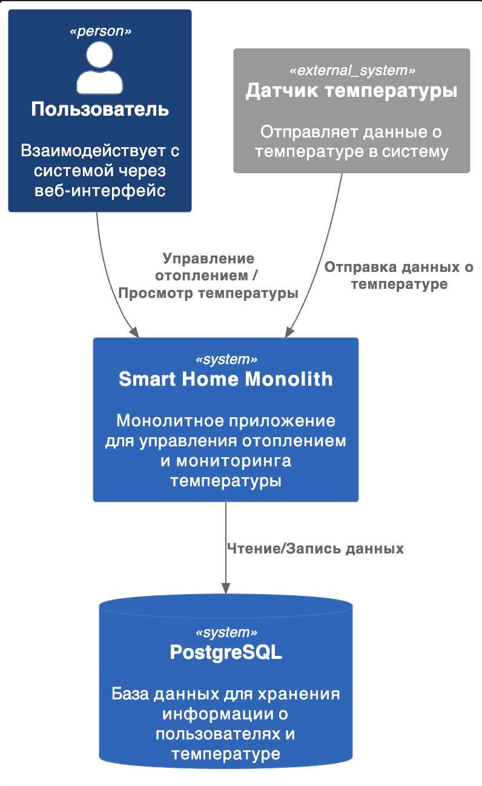
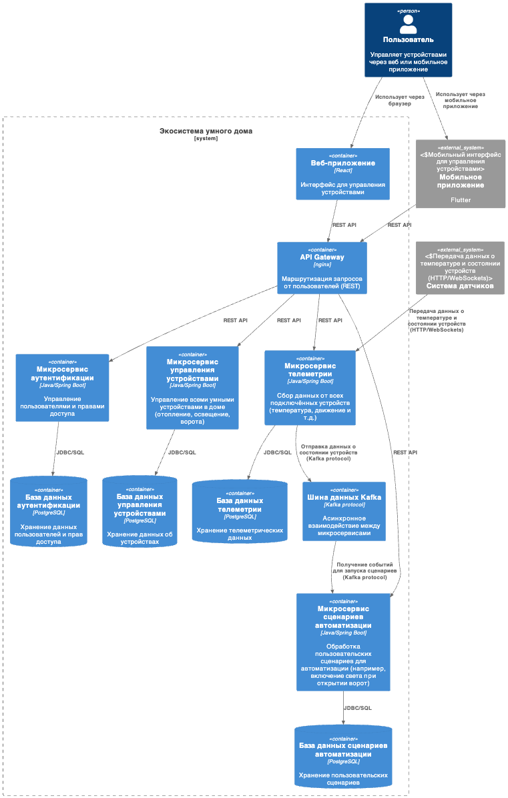
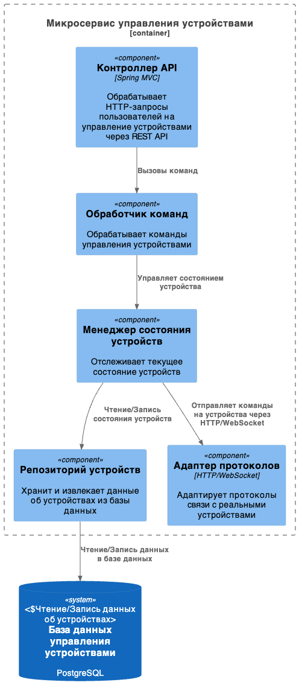
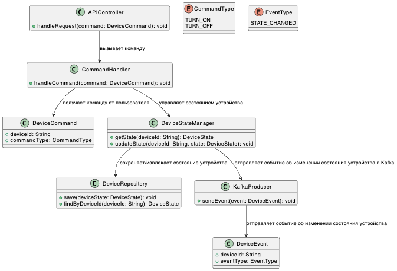
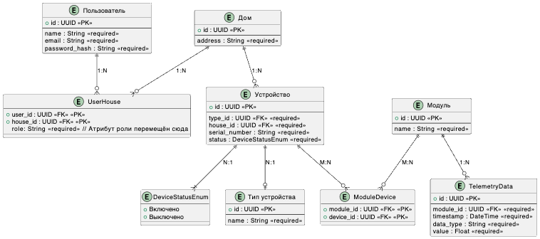

# Sprint 3

## Анализ текущей архитектуры

### 1. Изучение функциональности монолитного приложения

Приложение *Smart Home Monolith* предоставляет следующие ключевые функции:

- **Управление отоплением**: Пользователи могут удалённо включать и выключать отопление в своих домах через веб-интерфейс.
- **Мониторинг температуры**: Система получает данные о температуре с датчиков, установленных в домах, и отображает их пользователям через веб-интерфейс. Это позволяет пользователям отслеживать текущую температуру в реальном времени.

### 2. Анализ архитектуры монолитного приложения

Приложение построено на основе следующих технологий и архитектурных решений:

- **Язык программирования**: Java.
- **База данных**: PostgreSQL.
- **Архитектура**: Монолитная архитектура, где все компоненты (контроллеры, сервисы, репозитории) находятся в одном приложении. Это означает, что весь код приложения тесно связан и развёртывается как единое целое.
- **Взаимодействие**: Синхронная обработка запросов. Это может приводить к задержкам при высоких нагрузках, так как все запросы обрабатываются последовательно.
- **Масштабируемость**: Ограничена, так как монолитное приложение сложно масштабировать частично. Для увеличения производительности необходимо масштабировать всё приложение целиком.
- **Развёртывание**: Любое изменение требует перезапуска всего приложения, что может привести к простою системы.

### 3. Определение доменов и границ контекстов

Для данного приложения можно выделить несколько доменов:

- **Управление устройствами**: Этот домен включает управление отоплением (включение/выключение системы отопления).
- **Мониторинг данных с датчиков**: Этот домен отвечает за сбор и отображение данных о температуре с датчиков.
- **Пользовательский интерфейс (UI)**: Веб-интерфейс для взаимодействия пользователей с системой (отображение температуры, управление отоплением).
- **Аутентификация и авторизация**: Обеспечивает безопасность доступа к системе.

Эти домены можно разделить на отдельные контексты, которые в будущем могут быть вынесены в микросервисы для улучшения масштабируемости и управляемости системы.

### 4. Проблемы монолитной архитектуры

Монолитная архитектура имеет несколько недостатков в контексте бизнес-задач компании:

- **Масштабируемость**: Как уже отмечалось, монолитное приложение сложно масштабировать по частям. Например, если нагрузка возрастает только на модуль мониторинга температуры, придётся масштабировать всё приложение целиком.
  
- **Гибкость разработки**: Внесение изменений в один компонент требует пересборки и перезапуска всего приложения. Это замедляет процесс разработки и развёртывания новых функций.

- **Низкая отказоустойчивость**: Падение одного компонента может привести к остановке всего приложения. Например, если возникнет проблема с модулем управления отоплением, это может повлиять на всю систему.

- **Зависимость компонентов**: Все компоненты тесно связаны между собой, что усложняет тестирование и внесение изменений без риска повредить другие части системы.

### 5. Диаграмма контекста (Context Diagram)



файл: [SH-monolith-components.puml](./diagrams/SH-monolith-components.puml)


## Проектирование новой микросервисоной архитектуры


### 1. Декомпозиция приложения на микросервисы

Для декомпозиции монолитного приложения на микросервисы, основываясь на ранее выделенных доменах и бизнес-целях компании «Тёплый дом», можно предложить следующую структуру микросервисов.

#### **As-Is решение (текущее состояние)**:

- **Микросервис управления отоплением**:
  - Отвечает за включение/выключение отопления.
  - Обрабатывает команды от пользователя через веб-интерфейс.
  - Взаимодействует с устройствами отопления через API.

- **Микросервис мониторинга температуры**:
  - Получает данные с датчиков температуры.
  - Хранит и отображает данные пользователю в реальном времени.

#### **To-Be решение (целевая архитектура)**:

Для достижения целей компании и расширения функциональности системы, потребуется добавить новые микросервисы и переработать существующие:

- **Микросервис управления устройствами**:
  - Управление всеми умными устройствами в доме (отопление, освещение, ворота и т.д.).
  - Поддержка стандартных протоколов для взаимодействия с устройствами от разных производителей.
  - Подключение новых устройств пользователем через самообслуживание.

- **Микросервис сценариев автоматизации**:
  - Позволяет пользователям создавать и управлять сценариями работы устройств (например, включение света при открытии ворот).
  
- **Микросервис телеметрии и мониторинга**:
  - Сбор данных от всех подключённых устройств (температура, состояние устройств).
  - Хранение и отображение данных пользователям через веб-интерфейс.

- **Микросервис аутентификации и авторизации**:
  - Управление пользователями, их правами доступа к системе.
  
- **Микросервис уведомлений**:
  - Отправка уведомлений пользователям в случае срабатывания сценариев или возникновения проблем (например, если температура упала ниже заданного уровня).

### 2. Взаимодействие компонентов

#### **Взаимодействие между микросервисами**:

- Микросервисы будут взаимодействовать друг с другом через API Gateway. Это позволит централизовать маршрутизацию запросов от клиентов к нужным микросервисам.
  
- Для обмена данными между микросервисами можно использовать шину данных. Это позволит организовать асинхронное взаимодействие, что повысит отказоустойчивость системы. Например, микросервис телеметрии может отправлять данные о состоянии устройств в очередь сообщений, а микросервис сценариев автоматизации будет их обрабатывать.

#### **API Gateway**:

- API Gateway будет служить точкой входа для всех внешних запросов от клиентов. Он будет маршрутизировать запросы к соответствующим микросервисам (например, запросы на управление устройствами или получение телеметрии).

#### **Шина данных (Kafka)**:

- Kafka будет использоваться для передачи сообщений между микросервисами в асинхронном режиме. Например:
  - Микросервис телеметрии отправляет данные о состоянии устройств в Kafka.
  - Микросервис сценариев автоматизации получает эти данные и запускает сценарии.

#### **База данных**:

Каждый микросервис будет иметь свою собственную базу данных для обеспечения изоляции данных. Это соответствует принципам архитектуры микросервисов и позволяет избежать проблем с разделением ответственности за данные.

### 3. Визуализация архитектуры


#### C4 — Уровень контейнеров (Containers)



файл: [MS-Containers_v3.puml](./diagrams/MS-Containers_v3.puml)


#### C4 — Уровень компонентов (Components)
Пример для микросервиса управления устройствами:



файл: [MS-Components_v3.puml](./diagrams/MS-Components_v3.puml)


#### C4 — Уровень кода (Code)
Пример диаграммы классов для компонента Command Handler в микросервисе управления устройствами:



файл: [SH-ms-code.puml](./diagrams/SH-ms-code.puml)


## Диаграмма связей между сущностями




файл: [MS-Er_v3.puml](./diagrams/MS-Er_v3.puml)


-----------------------------------------------------------------------------

# Задание 2.1

### 1. Выбор типов API

Для взаимодействия между микросервисами мы будем использовать следующие подходы:
- **REST API**: Для синхронного взаимодействия (например, управление устройствами или получение информации о них).
- **AsyncAPI**: Для асинхронного взаимодействия через Kafka (например, отправка событий о состоянии устройств или телеметрии).

---

### 2. Проектирование API для микросервиса управления устройствами

#### Основные операции:
1. Получение списка устройств.
2. Получение информации об устройстве.
3. Обновление состояния устройства.
4. Отправка команды устройству.

---

#### Эндпоинты для REST API:

##### 1. **Получение списка устройств**
- **Метод**: `GET`
- **URL**: `/devices`
- **Описание**: Возвращает список всех устройств, доступных пользователю.

**Формат ответа (JSON)**:
```json
[
  {
    "id": "uuid",
    "name": "Отопление",
    "type": "Heating",
    "status": "Включено",
    "house_id": "uuid"
  },
  {
    "id": "uuid",
    "name": "Освещение",
    "type": "Lighting",
    "status": "Выключено",
    "house_id": "uuid"
  }
]
```

**Коды ответа**:
- `200 OK`: Успешное получение списка устройств.
- `500 Internal Server Error`: Ошибка сервера.

---

##### 2. **Получение информации об устройстве**
- **Метод**: `GET`
- **URL**: `/devices/{deviceId}`
- **Описание**: Возвращает информацию о конкретном устройстве.

**Формат ответа (JSON)**:
```json
{
  "id": "uuid",
  "name": "Отопление",
  "type": "Heating",
  "status": "Включено",
  "house_id": "uuid"
}
```

**Коды ответа**:
- `200 OK`: Успешное получение информации об устройстве.
- `404 Not Found`: Устройство не найдено.
- `500 Internal Server Error`: Ошибка сервера.

---

##### 3. **Обновление состояния устройства**
- **Метод**: `PATCH`
- **URL**: `/devices/{deviceId}/state`
- **Описание**: Обновляет состояние устройства (включено/выключено).

**Формат запроса (JSON)**:
```json
{
  "status": "Выключено"
}
```

**Формат ответа (JSON)**:
```json
{
  "id": "uuid",
  "status": "Выключено"
}
```

**Коды ответа**:
- `200 OK`: Успешное обновление состояния устройства.
- `400 Bad Request`: Неверный формат запроса.
- `404 Not Found`: Устройство не найдено.
- `500 Internal Server Error`: Ошибка сервера.

---

##### 4. **Отправка команды устройству**
- **Метод**: `POST`
- **URL**: `/devices/{deviceId}/commands`
- **Описание**: Отправляет команду на устройство.

**Формат запроса (JSON)**:
```json
{
  "command": "TURN_ON"
}
```

**Формат ответа (JSON)**:
```json
{
  "id": "uuid",
  "command_status": "SUCCESS"
}
```

**Коды ответа**:
- `200 OK`: Команда успешно отправлена.
- `400 Bad Request`: Неверный формат команды.
- `404 Not Found`: Устройство не найдено.
- `500 Internal Server Error`: Ошибка сервера.

---

### Эндпоинты для AsyncAPI:

##### Событие: Изменение состояния устройства
При изменении состояния устройства микросервис отправляет событие в Kafka.

```yaml
channels:
  device.state.changed:
    publish:
      summary: Событие изменения состояния устройства
      payload:
        type: object
        properties:
          deviceId:
            type: string
          status:
            type: string
            enum: ["Включено", "Выключено"]
          timestamp:
            type: string
            format: date-time
```

---

### Пример документации для Swagger/OpenAPI:

Пример для эндпоинта получения списка устройств:

```yaml
openapi: 3.0.0
info:
  title: API управления устройствами
  version: 1.0.0
paths:
  /devices:
    get:
      summary: Получение списка устройств
      responses:
        '200':
          description: Список устройств успешно получен
          content:
            application/json:
              schema:
                type: array
                items:
                  type: object
                  properties:
                    id:
                      type: string
                    name:
                      type: string
                    type:
                      type: string
                    status:
                      type: string
                      enum: ["Включено", "Выключено"]
                    house_id:
                      type: string
        '500':
          description: Ошибка сервера
```

-----------------------------------------------------------------------------


# Базовая настройка

## Запуск minikube

[Инструкция по установке](https://minikube.sigs.k8s.io/docs/start/)

```bash
minikube start
```

## Добавление токена авторизации GitHub

[Получение токена](https://github.com/settings/tokens/new)

```bash
kubectl create secret docker-registry ghcr --docker-server=https://ghcr.io --docker-username=<github_username> --docker-password=<github_token> -n default
```

## Установка API GW kusk

[Install Kusk CLI](https://docs.kusk.io/getting-started/install-kusk-cli)

```bash
kusk cluster install
```

## Смена адреса образа в helm chart

После того как вы сделали форк репозитория и у вас в репозитории отработал GitHub Action. Вам нужно получить адрес образа <https://github.com/><github_username>/architecture-sprint-3/pkgs/container/architecture-sprint-3

Он выглядит таким образом
```ghcr.io/<github_username>/architecture-sprint-3:latest```

Замените адрес образа в файле `helm/smart-home-monolith/values.yaml` на полученный файл:

```yaml
image:
  repository: ghcr.io/<github_username>/architecture-sprint-3
  tag: latest
```

## Настройка terraform

[Установите Terraform](https://yandex.cloud/ru/docs/tutorials/infrastructure-management/terraform-quickstart#install-terraform)

Создайте файл ~/.terraformrc

```hcl
provider_installation {
  network_mirror {
    url = "https://terraform-mirror.yandexcloud.net/"
    include = ["registry.terraform.io/*/*"]
  }
  direct {
    exclude = ["registry.terraform.io/*/*"]
  }
}
```

## Применяем terraform конфигурацию

```bash
cd terraform
terraform init
terraform apply
```

## Настройка API GW

```bash
kusk deploy -i api.yaml
```

## Проверяем работоспособность

```bash
kubectl port-forward svc/kusk-gateway-envoy-fleet -n kusk-system 8080:80
curl localhost:8080/hello
```

## Delete minikube

```bash
minikube delete
```
